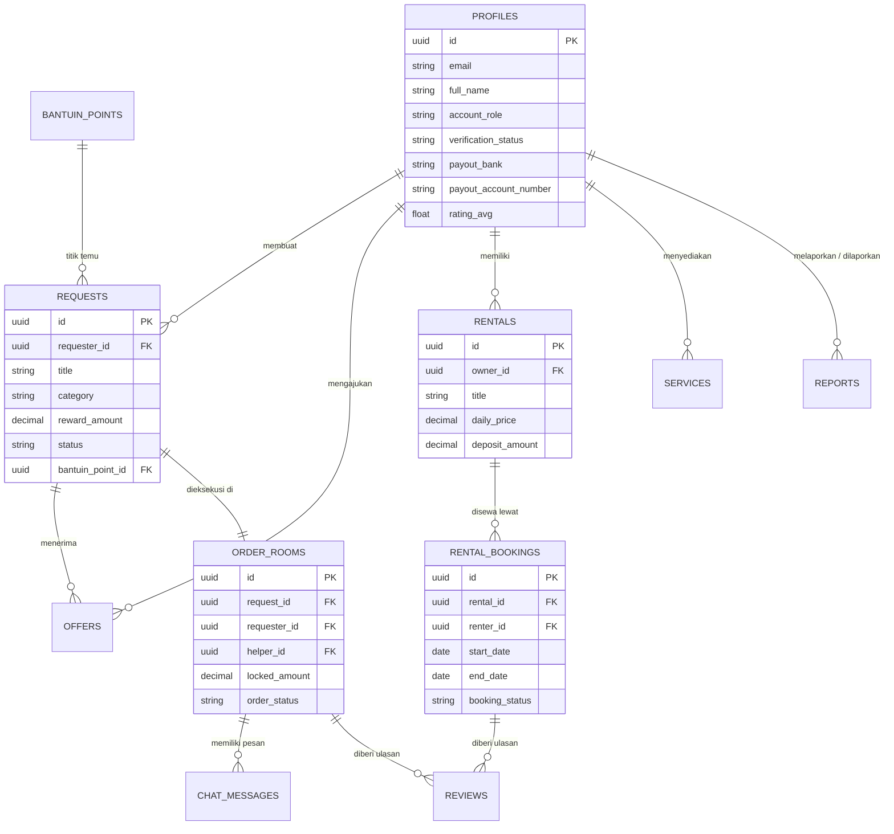

# 🚀 Bantuin.id — Platform P2P Layanan, Rental & Jasa Mahasiswa Kampus

> **Bantuin.id** adalah platform hyper-local *peer-to-peer* (P2P) terpadu berbasis kampus yang menghubungkan mahasiswa dan civitas akademika untuk saling membantu dalam kebutuhan harian, penyewaan barang/peralatan, serta layanan jasa keahlian dengan sistem keamanan escrow dan titik temu aman (*Bantuin Points*).

---

## 📑 Daftar Isi

1. [Tentang Platform](#-tentang-platform)
2. [Fitur Utama & Pilar Layanan](#-fitur-utama--pilar-layanan)
3. [Arsitektur & Tech Stack](#-arsitektur--tech-stack)
4. [Struktur Folder & Direktori](#-struktur-folder--direktori)
5. [Skema Database & Entitas (Supabase)](#-skema-database--entitas-supabase)
6. [Alur Transaksi & Sistem Pembayaran](#-alur-transaksi--sistem-pembayaran)
7. [Panduan Instalasi & Menjalankan Lokal](#-panduan-instalasi--menjalankan-lokal)
8. [Konfigurasi Environment Variables](#-konfigurasi-environment-variables)
9. [Peran Pengguna & Hak Akses](#-peran-pengguna--hak-akses)
10. [Keamanan, KYC & Kepatuhan](#-keamanan-kyc--kepatuhan)

---

## 🌟 Tentang Platform

Bantuin.id hadir untuk menyelesaikan masalah mobilitas, kebutuhan perlengkapan mendadak, dan ekonomi mahasiswa di sekitar area kampus dengan menyediakan 3 pilar ekosistem:
1. **Titip / Bantuan Kilat (Errands)**: Kirim dokumen, print tugas, beli makanan/titipan, hingga bantuan darurat dengan reward terjangkau atau sukarela (*voluntary*).
2. **Sewa Alat & Barang (Rentals)**: Sewa kamera, proyektor, peralatan event, laptop, atau instrumen dari mahasiswa lain atau mitra toko terdekat dengan sistem uang jaminan (*deposit lock*).
3. **Jasa & Keahlian (Services)**: Marketplace freelance mahasiswa (desain grafis, fotografi, web programming, joki ketik/tutor, dll.).

---

## 🎯 Fitur Utama & Pilar Layanan

### 1. 🏃 Bantuan & Errands (`/bantuan`, `/order`)
- **Posting Kebutuhan**: Input detail bantuan, estimasi waktu/deadline, titik lokasi (publik/terenkripsi), dan nominal reward.
- **Helper Bidding & Offers**: Mahasiswa lain (Helper) dapat mengajukan tawaran beserta estimasi kedatangan.
- **Bantuin Points**: Titik temu aman di area kampus (gerbang, perpustakaan, minimarket terverifikasi) untuk menjaga keamanan transaksi fisik.

### 2. 📸 Sewa Barang & Rental (`/sewa`, `/mitra`)
- **Katalog Rental**: Kamera, gadget, sound system, proyektor, hingga perlengkapan outdoor.
- **Sistem Booking & Deposit**: Penguncian tanggal sewa otomatis (*temp locked*) dan penahanan dana deposit untuk perlindungan aset pemilik.
- **Checklist Kondisi Fisik**: Foto dan catatan kondisi barang saat serah terima (handover) & pengembalian (return).

### 3. 🎨 Jasa Keahlian & Freelance (`/jasa`)
- **Portofolio Jasa**: Listing keterampilan mahasiswa dengan rentang harga, rating, dan riwayat pesanan selesai.

### 4. 🔒 Order Room & Live Chat (`/chat`, `/activity`)
- **Bilik Transaksi Terisolasi**: Room khusus untuk pemesan dan helper/pemilik barang.
- **Deteksi Disintermediasi**: Filter keamanan pintar untuk mendeteksi nomor telepon, link luar, atau upaya transaksi di luar sistem.
- **Bukti Selesai (Proof Submission)**: Upload foto bukti pekerjaan sebelum dana escrow dicairkan.

### 5. 🛡️ Admin Dashboard Terpadu (`/admin`)
- **Verifikasi KYC (KTP/NIM)**: Validasi identitas pengguna untuk meningkatkan kepercayaan.
- **Manajemen Dispute / Sengketa**: Mediasi komplain antara pemesan dan penyedia jasa/penyewa.
- **Pencairan Dana (Withdrawal & Payout)**: Pengelolaan request payout ke rekening bank pengguna (BCA, Mandiri, BRI, BNI, BSI).
- **Audit Logs**: Rekam jejak seluruh aktivitas administratif platform secara *immutable*.

---

## 🛠️ Arsitektur & Tech Stack

| Komponen | Teknologi | Keterangan |
| :--- | :--- | :--- |
| **Frontend Framework** | [Next.js 15](https://nextjs.org/) (App Router) | Menggunakan Turbopack untuk performa dev super cepat |
| **Library UI** | [React 19](https://react.dev/) | React Server & Client Components |
| **Styling** | [Tailwind CSS v4](https://tailwindcss.com/) | Desain responsif modern & utility-first |
| **Icons & Komponen** | [Lucide React](https://lucide.dev/) & [clsx](https://github.com/lukeed/clsx) | Ikon dinamis terstandarisasi |
| **Peta Interaktif** | [Leaflet](https://leafletjs.com/) | Visualisasi lokasi Bantuin Points & radius lokasi |
| **Backend & Auth** | [Supabase](https://supabase.com/) | PostgreSQL Database, Auth, Storage & Realtime |
| **Payment Gateway** | [Tripay](https://tripay.co.id/) & [Xendit](https://www.xendit.co/) | Penerimaan pembayaran (Tripay) & Disbursement/Escrow (Xendit) |

---

## 📁 Struktur Folder & Direktori

```text
bantuin.id/
├── app/                        # Next.js App Router Pages & API Routes
│   ├── activity/               # Riwayat pesanan & aktivitas pengguna
│   ├── admin/                  # Dashboard Superadmin (KYC, dispute, payout, logs)
│   ├── api/                    # Endpoint API Next.js (webhooks, payments, disbursements)
│   ├── auth/                   # Autentikasi (Login, Register, Callback, Lupa Password)
│   ├── bantuan/                # Listing & posting permintaan bantuan
│   ├── chat/                   # Halaman ruang pesan transaksi
│   ├── explore/                # Halaman eksplorasi interaktif
│   ├── jasa/                   # Listing & detail jasa keahlian
│   ├── mitra/                  # Portal mitra toko rental & merchant
│   ├── order/                  # Alur pembuatan dan pelacakan order
│   ├── profile/                # Pengaturan profil, reputasi & rekening bank
│   ├── sewa/                   # Listing barang sewa & alur booking
│   ├── layout.jsx              # Root layout aplikasi (Navbar, Footer, Providers)
│   └── globals.css             # Tailwind CSS & konfigurasi styling global
│
├── components/                 # Komponen UI Reusable
│   ├── auth/                   # Modal & form login/register
│   ├── cards/                  # Kartu bantuan, sewa, dan jasa
│   ├── chat/                   # Komponen room chat & bubble pesan
│   ├── common/                 # Komponen umum (Navbar, Footer, Badge, CategoryIcon)
│   ├── map/                    # Integrasi peta Leaflet & Bantuin Points
│   ├── modals/                 # Modal konfirmasi, KYC, dan review
│   └── ui/                     # Komponen primitive UI (Button, Input, Alert, dll.)
│
├── lib/                        # Business Logic, Services & State
│   ├── categories.js           # Single Source of Truth kategori platform
│   ├── categoryIcons.js        # Dynamic icon resolver untuk kategori
│   ├── security.js             # Validasi keamanan, filter chat, dan token
│   ├── context/                # React Context (AuthContext, CartContext, dll.)
│   ├── services/               # Modular API Services (Auth, Order, Rental, Admin, dll.)
│   │   ├── authService.js
│   │   ├── orderService.js
│   │   ├── rentalService.js
│   │   ├── paymentService.js
│   │   ├── adminService.js
│   │   └── ...
│   └── supabase/               # Client Supabase & helper koneksi
│
├── supabase/                   # Database Supabase & Migration
│   └── schema.sql              # Master DDL Schema, Enums, RLS Policies & Triggers
│
├── public/                     # Aset statis (gambar, logo, ikon)
├── .env.example                # Template variabel lingkungan
└── package.json                # Dependensi dan script build
```

---

## 🗄️ Skema Database & Entitas (Supabase)

Struktur tabel utama yang didefinisikan dalam `supabase/schema.sql`:



### Keamanan Row Level Security (RLS)
Setiap tabel dilengkapi kebijakan RLS aktif:
- **`profiles`**: Publik dapat melihat info profil ringkas; hanya pemilik yang bisa mengubah data pribadi.
- **`order_rooms` & `chat_messages`**: Hanya pihak yang terlibat (Pemesan dan Helper) yang memiliki akses baca & tulis.
- **`audit_logs`**: Eksklusif hanya dapat diakses oleh profil berstatus `is_admin = true`.

---

## 💳 Alur Transaksi & Sistem Pembayaran

1. **Pembuatan Pesanan / Booking**:
   - Pemesan membuat permintaan bantuan atau membooking rental barang.
2. **Escrow Lock (Penahanan Dana)**:
   - Pemesan melakukan pembayaran melalui gateway (Tripay/Xendit). Dana disimpan di akun penampung aman (*escrow*) platform.
3. **Eksekusi & Serah Terima**:
   - Helper/Penyedia menyelesaikan tugas atau menyerahkan barang sewa di titik temu aman (*Bantuin Point*).
   - Helper mengunggah foto bukti (*proof of work / condition checklist*).
4. **Konfirmasi & Auto-Settlement**:
   - Pemesan mengonfirmasi bahwa tugas telah selesai atau barang telah kembali dalam kondisi baik.
   - Jika pemesan tidak merespon dalam batas waktu, sistem mengaktifkan *auto-approve*.
5. **Pencairan Dana (Disbursement)**:
   - Dana ditransfer ke saldo reward helper dan dapat dicairkan (*withdraw*) ke rekening bank tujuan yang telah terverifikasi.

---

## 💻 Panduan Instalasi & Menjalankan Lokal

### Prasyarat
- **Node.js**: Versi 18.18+ atau Node.js 20+
- **NPM** atau **Yarn** / **PNPM**
- Proyek **Supabase** aktif

### Langkah Menjalankan

1. **Clone repositori dan masuk ke direktori**:
   ```bash
   git clone <url-repo-anda>
   cd bantuin.id
   ```

2. **Instal seluruh dependensi**:
   ```bash
   npm install
   ```

3. **Siapkan Environment Variables**:
   Salin berkas template `.env.example` menjadi `.env.local` atau `.env`:
   ```bash
   cp .env.example .env.local
   ```
   Isi konfigurasi kunci Supabase dan Payment Gateway Anda.

4. **Inisialisasi Database Supabase**:
   - Buka SQL Editor di Dashboard Supabase Anda.
   - Buka file `supabase/schema.sql` pada proyek ini, salin seluruh kodenya, dan jalankan (*Run*) di SQL Editor Supabase.

5. **Jalankan Server Development**:
   ```bash
   npm run dev
   ```
   Buka [http://localhost:3000](http://localhost:3000) pada browser Anda.

---

## 👥 Peran Pengguna & Hak Akses

| Peran (*Role*) | Deskripsi | Akses Utama |
| :--- | :--- | :--- |
| **User (Mahasiswa/Klien)** | Pengguna umum yang membutuhkan bantuan atau mencari barang/jasa | `/bantuan`, `/sewa`, `/jasa`, `/order`, `/activity` |
| **Provider (Penyedia Jasa)** | Mahasiswa yang menawarkan keahlian freelance | `/jasa`, profil keahlian, penawaran harga |
| **Partner (Mitra Rental)** | Toko, vendor rental, atau penyedia inventaris barang | `/mitra`, manajemen stok inventaris, booking rental |
| **Admin** | Tim operasional & pengawas platform | `/admin` (KYC review, dispute resolution, payout releases, audit logs) |

---

## 🛡️ Keamanan, KYC & Kepatuhan

- **KYC Vault (Enkripsi Identitas)**: Foto KTP/NIM disimpan dalam storage bucket private berstandar privasi tinggi dan hanya dapat diakses oleh Admin untuk verifikasi.
- **Anti-Fraud Chat Detection**: Filter otomatis di layer chat untuk mencegah pertukaran kontak berbahaya dan penipuan di luar sistem.
- **Audit Logging**: Setiap aksi krusial admin (verifikasi akun, penangguhan user, rilis pembayaran sengketa) dicatat secara permanen di tabel `audit_logs` bersama alamat IP dan payload metadata.

---

<div align="center">
  <sub>Dibuat dengan ❤️ untuk ekosistem mahasiswa yang lebih terhubung, aman, dan saling membantu.</sub>
</div>
